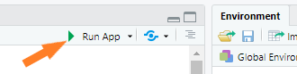

#

# <br>

# Melbourne Datathon 2020
## Can Electricity Consumption Patterns Tell Us Anything About The Pandemic?
<br>

## Data2App
### **Electricity Consumption in Australia**
#### A user-interactive data visualisation app developed in R Shiny that recites a story about how Australia consumes its electricity.

[Watch the product video](https://youtu.be/YY6TvY4pZu0)<br>
[Explore the app online](https://abhilash-kale.shinyapps.io/electricity-consumption-in-australia/)

### Setup on your local system

* Download and Install R in your system
```
https://cran.r-project.org/bin/
```
* Download and Install RStudio in your system
```
https://rstudio.com/products/rstudio/download/
```
* Clone this repository into your system
```
git clone https://github.com/akale1994/Melbourne-Datathon-2020.git
```
* Open the below files in RStudio
```
Data2App > App > server.R
Data2App > App > ui.R
```
* Install the required libraries
```
Uncomment the library installation code before running the app if the respective libraries are not installed
```
* Run the app
```
Click on 'Run App' as shown below
```
# <br>

<br>

## Insights
### **A Causal Forecasting Model built using Multi-layer Perceptron Artificial Neural Network** <br>
#### The model learns on pre Covid-19 data and forecasts the electricity prices in Victoria for the Covid-19 lockdown period in Victoria, Australia.

[Read the report](https://github.com/akale1994/Melbourne-Datathon-2020/blob/main/report/Report_MelbourneDatathon.pdf)

### Setup on your local system

* Download and install Python in your system
```
https://www.python.org/downloads/
```
* Download and install Anaconda in your system
```
https://docs.anaconda.com/anaconda/install/
```
* Download and install Jupyter Notebook in your system
```
https://jupyter.org/install/
```
* Clone this repository into your system
```
git clone https://github.com/akale1994/Melbourne-Datathon-2020.git
```
* Open and run the notebook from Jupyter Notebook
```
Root directory > MelbourneDatathon.ipynb
```
